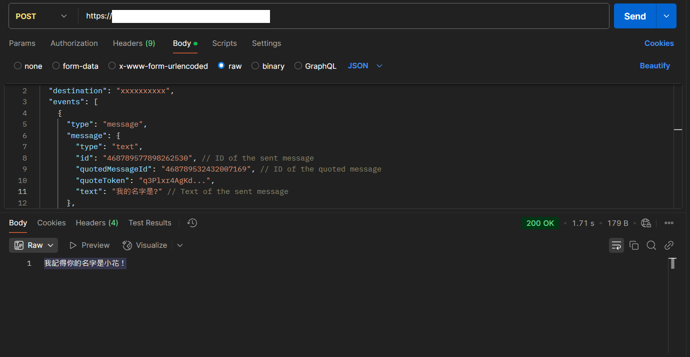

# AI LINE Bot Demo

## 專案簡介

隨著 AI 技術的快速發展，近期引起了廣泛關注。在探索相關技術時，發現有關 **本地運行 AI** 的資訊。最初的接觸方式是透過 **Open WebUI** 作為介面，並搭配 **Ollama** 執行不同的語言模型。

進一步了解後，發現與 **Ollama** 互動是通過 **HTTP 協議** 進行的。這為我帶來了靈感，開始思考如何基於 **Spring Boot** 設計一個專案，作為串接不同介面的架構，並進一步拓展應用。

本專案利用四種方式實現與 **Ollama** 的互動，分別是：使用 **RestTemplate**、**Spring AI OllamaApi**、**Spring AI OllamaChatModel** 和 **Spring AI ChatClient**。

最終，專案選擇與 **LINE Bot Message API** 串接，實現了能夠進行文字聊天的 AI LINE Bot。

## 功能展示與截圖

### 1. 使用 **RestTemplate** 與 **Ollama** 互動

- 透過建立 `AppConfig.java` 類別來管理 `RestTemplate` 組件，以便於處理 HTTP 請求，並呼叫 RESTful API。

- 參考資料：
  - [Spring AI Reference Doc](https://docs.spring.io/spring-ai/reference/api/chat/ollama-chat.html)
  - [Ollama 相關文件](https://github.com/ollama/ollama/blob/main/docs/api.md)

- 使用 POJO（Plain Old Java Object）擴展結構 DTO（Data Transfer Object）來封裝資料，並建立相應的 Java 類別：`OllamaRequest` 和 `OllamaResponse`。

- 在 Controller 層建立相關的請求處理類別和 Mapping 方法。由於該方式並非最終使用的互動方式，為了方便測試，直接使用 `@GetMapping`。

```java
// 直接使用 HTTP 與 Ollama 互動
@GetMapping("/ollama/{message}")
public String handleLineWebhook(@PathVariable String message) {
	
	// 發送請求
	OllamaResponse sendReplyMessage = ollamaHttpService.callOllama(message);

	System.out.println(sendReplyMessage);

	return sendReplyMessage.getResponse();
}
```

- 在 Service 層建立處理業務邏輯的類別。

```java
@Service
public class OllamaHttpService {
	
	@Autowired
	private RestTemplate restTemplate;
	
	/**
	 * 使用 RestTemplate 發送 HTTP 請求與 Ollama 互動
	 */
	public OllamaResponse callOllama(String prompt) {
		
		// 設定 URL
		String url = "http://127.0.0.1:11434/api/generate";

		// 建立請求體
		OllamaRequest requestDto = new OllamaRequest();
		requestDto.setModel("llama3.1:latest");
		requestDto.setPrompt("請您以繁體中文回答，" + prompt);
		requestDto.setStream(false);

		// 建立 HTTP 標頭
		HttpHeaders headers = new HttpHeaders();

		// 將請求體轉換為 JSON
		HttpEntity<OllamaRequest> requestEntity = new HttpEntity<>(requestDto, headers);
		
		// 發送 POST 請求並取得回應
		ResponseEntity<OllamaResponse> responseEntity = restTemplate.exchange(url, HttpMethod.POST, requestEntity, OllamaResponse.class);

		// 回傳模型的回應
		return responseEntity.getBody();
	}
}
```

- 測試結果：


### 2. 使用 **Spring AI OllamaApi** 和 **Spring AI OllamaChatModel** 與 **Ollama** 互動

- 由於這並非最終使用的互動方式，為了便於測試，直接在 Controller 層使用 `@GetMapping` 處理請求並回應。

```java
// 使用 Spring AI OllamaChatModel 與 Ollama 互動
@GetMapping("/OllamaChatModel/{message}")
public Map<String, String> generate(@PathVariable String message) {

	System.out.println(message);

	return Map.of(
	    "generation", 
	    chatModel.call(new Prompt(
	        List.of(
	            new UserMessage("我的名字叫做小白"),
	            new SystemMessage("如果您會用中文回覆會請以繁體中文回覆"), 
	            new SystemMessage("請您將自己想像成一個霸道總裁，並且您不要主動提及您自己的稱謂"),
	            new UserMessage(message)
	        )
	    )).getContents()
	);
}
```

- `OllamaChatModel` 測試結果：


```java
// 使用 Spring AI OllamaApi 與 Ollama 互動
@GetMapping("/OllamaApi/{message}")
public Map<String, String> test(@PathVariable String message) {

	OllamaApi ollamaApi = new OllamaApi("http://127.0.0.1:11434");

	ChatRequest request = ChatRequest.builder("llama3.1:latest")
		.withStream(false) // not streaming
		.withMessages(List.of(
			Message.builder(Role.USER)
				.withContent("我名字叫做白白")
				.build(),
			Message.builder(Role.SYSTEM)
				.withContent("如果您會用中文回覆會以繁體中文回覆")
				.build(),
			Message.builder(Role.SYSTEM)
				.withContent("請您將自己想像成一個穩重的貓博士，並且您不要主動提及您自己的稱謂")
				.build(),
			Message.builder(Role.USER)
				.withContent(message)
				.build()))
		.withOptions(OllamaOptions.create().withTemperature(0.7d))
		.build();

	ChatResponse response = ollamaApi.chat(request);

	return Map.of("generation", response.message().content());
}
```

- `OllamaApi` 測試結果：


  
### 3. 使用 **Spring AI ChatClient** 與 **Ollama** 互動，實現記憶功能並與 **LINE Bot Message API** 串接，實現文字聊天的 AI LINE Bot

- 在 Service 層中使用 `ChatClient.Builder` 創建並設置 `ChatClient` 物件，以實現記憶功能。

```java
@Autowired
public OllamaChatClientService(ChatClient.Builder builder) {
	
	InMemoryChatMemory memory = new InMemoryChatMemory();
	
	this.chatClient = builder.defaultAdvisors( 
		new MessageChatMemoryAdvisor(memory) 
	).build();
}
```

- 參考資料：
  - 從 [LINE Developers 官方文件](https://developers.line.biz/en/docs/messaging-api/receiving-messages/) 了解接收到的文字訊息的 JSON 結構，並建立對應的 DTO 類別。

- 使用 `ngrok` 產生 HTTPS 映射。

- 使用 Postman 進行測試：




- 與 LINE Bot Message API 串接的實際功能展示：


## 專案成果與未來規劃

此專案實現了簡單的文字聊天 AI LINE Bot 功能，但仍有若干技術細節需要改進。以下是目前存在的問題及未來計劃：

### 需要改進的技術部分：

- **WebClient 替代 RestTemplate**：
  目前使用 **RestTemplate** 處理 HTTP 請求，未來計劃根據 **Spring 5** 的建議，改用 **WebClient**，以提升請求處理效率並享受更多功能與靈活性。

- **DTO 實現與 Spring Boot API**：
  在學習完 **Spring MVC** 後，我對 JSON 格式與 Java 類之間的轉換有了更深入的了解，因此使用 **DTO** 與 **LINE Bot Message API** 進行互動。不過，發現 **Spring Boot** 提供了相關的 API，這樣的做法將更為便捷，未來將改用內建解決方案。

- **日誌與異常訊息處理**：
  當前專案主要集中於功能實現，對於日誌與異常訊息處理尚未進行詳細規劃。未來將加強這方面的設計，以便有效排查錯誤，提升系統穩定性。

- **安全性與驗證機制**：
  目前專案中未設置任何認證和授權機制，考慮到系統的安全性，未來計劃加入驗證功能，以保護系統免於未經授權的訪問。

### 未來規劃：

- 針對上述提到的技術，將進一步探索和優化，並計劃學習 **微服務架構**，以提升系統的可擴展性和可維護性。特別是在功能增長後，微服務架構將有助於更好地管理和擴展各項服務。
